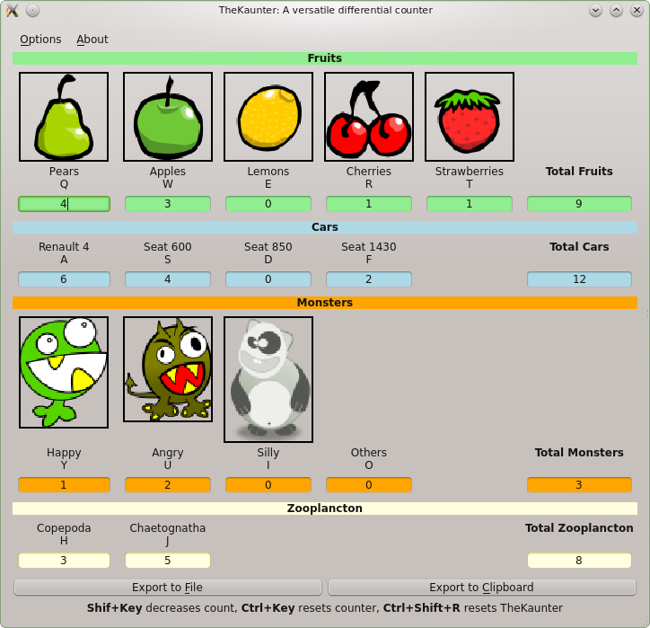

TheKaunter
==========

(c) Jorge Tornero Núñez, http://imasdemase.com

What is it?
===========

TheKaunter is a **multi-category, configurable differential counter**.

Differential counters are used in fields like haematology, for counting blood cells; in marine science, for instance, they are used for counting different kinds of plankton organisms (eggs, larvae...), among many other uses.

Classic (mechanical) differential counters have up to 10 individual counters and one totalizer. TheKaunter features the possibility of having several categories or groups of counters with one totalizer by category and, unlike mechanical counters, TheKaunter makes possible to reset individual counters and decrease the count.

License
=======
TheKaunter ir **released under GPL V3.0 license.** For further information please see http://www.gnu.org/licenses/gpl-3.0.html

Donations
=========
No donations/fees are required for the use of this software, but if you want to reward me in some way, you can send me a postcard from where you live. It will be nice to show to my kid!! In that case, you can mail me to get my postal address.
If you have a happy pocket, I'm sure you can help people around you, or donate some to your preferred charity/NGO. 

Features
=============
- **No theoretical limit of counters/categories**. However, up to a total of 36 individual counters is recommended, due to limitations in keyboard and desktop/GUI size.
- **Counters can be increased, decreased as well as individually reset.**
- One **totalizer for category/group** of counters.
- **User configurable section header** color as well as counter background
- User configurable **counter descriptive images.**
- **Category/counter names as well as key bindings are shown in the GUI** for ease of use.
- **Results are exportable** to CSV as well as to the clipboard.
- **Silent...** no more crank, lever, sounds in your lab...
- English as well as Spanish **translations for the GUI are provided.**

Future enhancements
===================
- Prettier CSV/clipboard export.
- Excel export with fancy headers and all.
- Better configuration file validation.
- Export to SQLite database.
- Connection to custom OpenHardware keyboard based on Arduino.

Dependencies
============
TheKaunter has been programmed under Python 2.7 and, as of version 2.0.0, TheKaunter depends on the following Python modules
- PyQt4
- Collections
- ConfigObg

Installation from source
========================
You can install TheKaunter just by copying the source files in a folder of your choice.
Four source files are provided:

- ***TheKaunter.py:*** The source code file for TheKAunter.
- ***theKaunter.conf:*** Sample configuration file for TheKaunter. **When starting, TheKaunter will look for it in the same folder that TheKaunter.py; if not found,TheKaunter will ask for a valid configuration file.** You can modify theKaunter.conf as you wish to meet your needs, or create a new one followint the instrucions provided in theKaunter.conf.
- ***theKaunter.qm:*** Translation file for TheKaunter. **It must be in the same folder that TheKaunter.py** if you want to have TheKaunter translated. By now, just Spanish translation is provided.
- ***theKaunter.ts:*** Source translation file for TheKaunter. It is not necessary for running TheKaunter, but you can edit it with the appropiate software (Qt Linguist) for having TheKaunter translated for your language, and release a new theKaunter.qm file. Please think about sharing your translations with the community.

Once all the dependencies are met,  just execute theKaunter.py.
**You could also download binaries for your platform in the RELEASES section of this repository**. Releases for GNU/Linux 32/64 bits, Windows 32/64 bits and Mac are planned, keep an eye in the repository to download the proper version for you.

